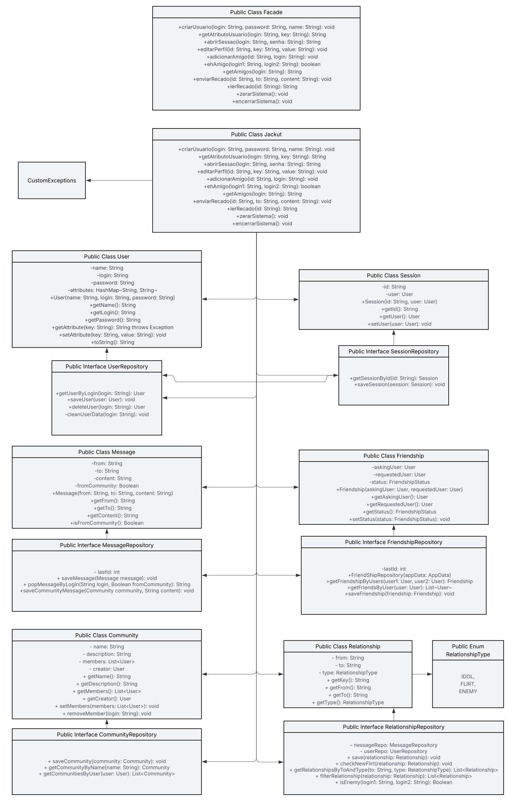

# Projeto Jackut
### Implementação de uma pequena rede social com persistência de dados e comandos controlados pelo terminal

- [Relatório do projeto](https://docs.google.com/document/d/1aIfr_SsJ1FrdivfbXKgZ9VYlldLa-U6riRDX6d666VA/edit?usp=sharing)

### Neste projeto, o usuário tem a possibilidade de realizar as seguintes funções
- Criar usuário;
- Fazer login;
- Ler atributos do usuário;
- Editar usuário;
- Adicionar amigos;
- Listar amigos;
- Enviar recados;
- Ler recados;

## Diagrama de Classes

